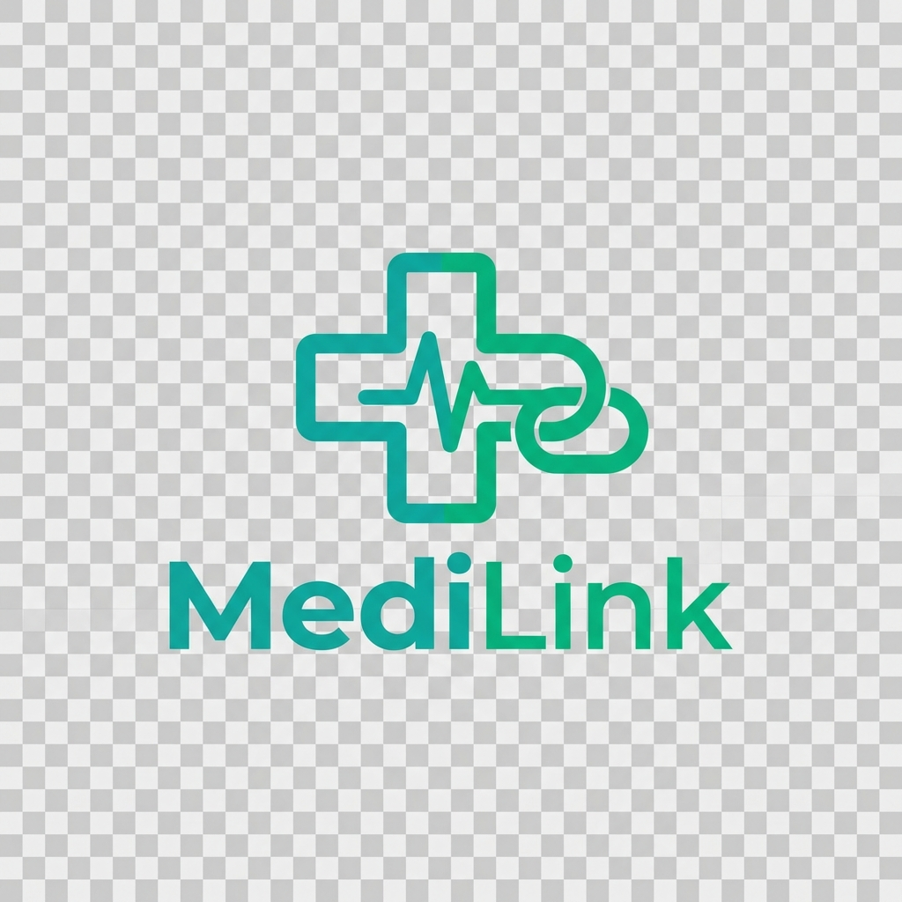

# MediLink - Next Gen Health OS



**MediLink** is a comprehensive, AI-powered health operating system designed to bridge the gap between patients, doctors, and emergency services. It provides a unified platform for health tracking, medical record management, virtual consultations, and emergency response.

## 🚀 Features

### For Patients
*   **AI Symptom Screener**: Instant triage analysis to understand symptoms and get care recommendations.
*   **Medication Reminders**: automated tracking and reminders for daily prescriptions.
*   **Health Dashboard**: "Big Button" accessible interface designed for all ages, tracking vitals (Heart Rate, Temp, Weight).
*   **Emergency SOS**: One-click emergency alert system notifying nearby hospitals and police.
*   **Appointment Booking**: Seamless scheduling with doctors.

### For Doctors
*   **Patient Management**: centralized view of patient records and history.
*   **Appointment Overview**: manageable daily schedules and video consultation interfaces.

### For Emergency Services (Police)
*   **Live Alert Dashboard**: Real-time notifications of SOS triggers with location data.

## 🛠️ Tech Stack

*   **Framework**: [Next.js 14](https://nextjs.org/) (App Router)
*   **Styling**: [Tailwind CSS](https://tailwindcss.com/)
*   **Icons**: [Lucide React](https://lucide.dev/)
*   **State Management**: [Zustand](https://github.com/pmndrs/zustand)
*   **Theme**: `next-themes` (Dark/Light mode support)

## 📦 Installation

1.  **Clone the repository**
    ```bash
    git clone https://github.com/ranjan-arnav/MediLink.git
    cd MediLink
    ```

2.  **Install dependencies**
    ```bash
    npm install
    # or
    yarn install
    # or
    pnpm install
    ```

3.  **Run Development Server**
    ```bash
    npm run dev
    ```
    Open [http://localhost:3000](http://localhost:3000) to view the application.

## 📱 Usage

1.  **Select Role**: Choose to enter as a Patient, Doctor, or Police Officer from the main landing page.
2.  **Patient View**: Use the dashboard to check symptoms or view reminders.
3.  **Doctor View**: Access patient lists and schedule.

## 🔒 Security

MediLink prioritizes user privacy. All data is handled with standard security practices. (Mock data used for demonstration purposes).

## 📄 License

This project is licensed under the MIT License.
